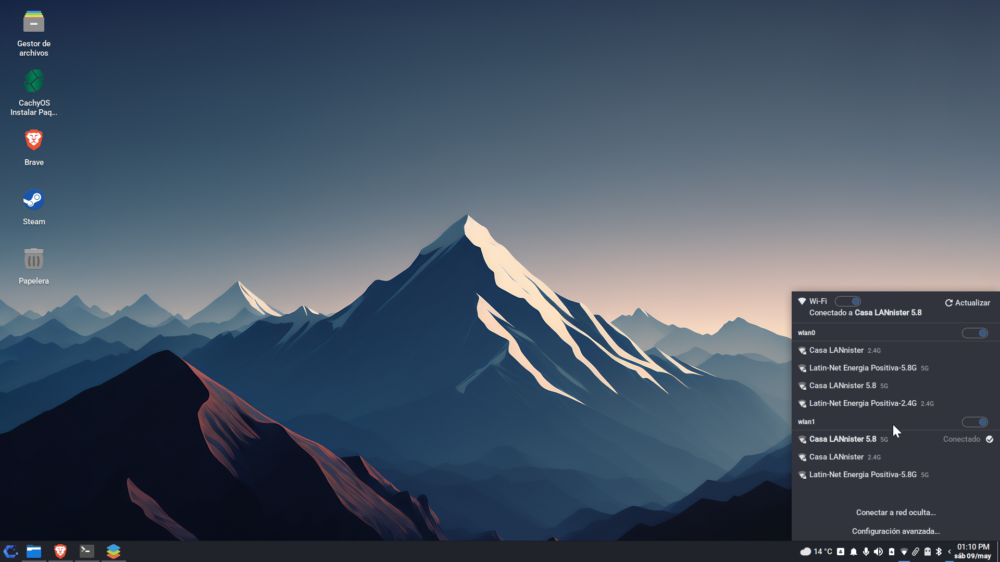

# xfce-net-plugin

*[English below](#english)*

---

## Español

Plugin de panel para Xfce que reemplaza a `nm-applet`. Muestra el estado de la red Wi-Fi y permite conectarse, desconectarse y gestionar redes directamente desde el panel, sin depender de herramientas externas.

### Capturas




### Características

- Comunicación directa con NetworkManager vía DBus (sin libnm)
- Soporte para múltiples adaptadores Wi-Fi
- Detección de redes seguras (WPA2/WPA3)
- Indicador de banda (2.4G / 5G / 6G)
- Conexión a redes ocultas
- Soporte VPN (WireGuard y perfiles NM)
- Sección Ethernet (visible solo si hay cable conectado)
- Switch global de Wi-Fi y switch por adaptador
- Tamaño del popup configurable desde Propiedades
- Configuración persistente en `~/.config/xfce4/panel/xfce-net-plugin.ini`
- Internacionalización: es, en, de, fr, pt_BR, it, nl, pl, ru, zh_CN, ja

### Instalación

#### Paquetes pre-compilados

| Distro | Paquete |
|--------|---------|
| Debian 12 / Debian 13 (amd64) | [xfce-net-plugin_1.0.0-1_amd64.deb](https://github.com/Tantin1/xfce-net-plugin/releases/tag/v1.0.0) |
| Arch Linux y derivadas (x86_64) | [xfce-net-plugin-1.0.0-1-x86_64.pkg.tar.zst](https://github.com/Tantin1/xfce-net-plugin/releases/tag/v1.0.0) |

#### Compilar desde fuente

**Arch Linux (CachyOS, Manjaro, EndeavourOS, Garuda, etc.)**

```bash
sudo pacman -S cmake pkgconf gtk3 xfce4-panel gettext
```

**Debian 12 / Debian 13**

```bash
sudo apt install cmake pkg-config libgtk-3-dev libxfce4panel-2.0-dev gettext
```

**Compilación e instalación (todas las distros)**

```bash
git clone https://github.com/Tantin1/xfce-net-plugin.git
cd xfce-net-plugin
mkdir build && cmake -S src -B build
cmake --build build
sudo cmake --install build
xfce4-panel -r
```

### Compatibilidad

- Arch Linux (CachyOS, Manjaro, EndeavourOS, Garuda, etc.)
- Debian 12 (Bookworm)
- Debian 13 (Trixie)
- Xfce 4.18+ sobre X11

### Licencia

GPL v2. Ver [LICENSE](LICENSE).

### Créditos

Desarrollado por [Tantin1](https://github.com/Tantin1).

---

## English

<a name="english"></a>

An Xfce panel plugin that replaces `nm-applet`. Shows Wi-Fi status and lets you connect, disconnect, and manage networks directly from the panel, without relying on external tools.

### Screenshots


### Features

- Direct NetworkManager communication via DBus (no libnm)
- Multiple Wi-Fi adapter support
- Secure network detection (WPA2/WPA3)
- Band indicator (2.4G / 5G / 6G)
- Connect to hidden networks
- VPN support (WireGuard and NM profiles)
- Ethernet section (visible only when cable is connected)
- Global Wi-Fi switch and per-adapter switch
- Configurable popup size from Properties
- Persistent config at `~/.config/xfce4/panel/xfce-net-plugin.ini`
- Internationalization: es, en, de, fr, pt_BR, it, nl, pl, ru, zh_CN, ja

### Installation

#### Pre-built packages

| Distro | Package |
|--------|---------|
| Debian 12 / Debian 13 (amd64) | [xfce-net-plugin_1.0.0-1_amd64.deb](https://github.com/Tantin1/xfce-net-plugin/releases/tag/v1.0.0) |
| Arch Linux and derivatives (x86_64) | [xfce-net-plugin-1.0.0-1-x86_64.pkg.tar.zst](https://github.com/Tantin1/xfce-net-plugin/releases/tag/v1.0.0) |

#### Build from source

**Arch Linux (CachyOS, Manjaro, EndeavourOS, Garuda, etc.)**

```bash
sudo pacman -S cmake pkgconf gtk3 xfce4-panel gettext
```

**Debian 12 / Debian 13**

```bash
sudo apt install cmake pkg-config libgtk-3-dev libxfce4panel-2.0-dev gettext
```

**Build & install (all distros)**

```bash
git clone https://github.com/Tantin1/xfce-net-plugin.git
cd xfce-net-plugin
mkdir build && cmake -S src -B build
cmake --build build
sudo cmake --install build
xfce4-panel -r
```

### Compatibility

- Arch Linux (CachyOS, Manjaro, EndeavourOS, Garuda, etc.)
- Debian 12 (Bookworm)
- Debian 13 (Trixie)
- Xfce 4.18+ on X11

### License

GPL v2. See [LICENSE](LICENSE).

### Credits

Developed by [Tantin1](https://github.com/Tantin1).
